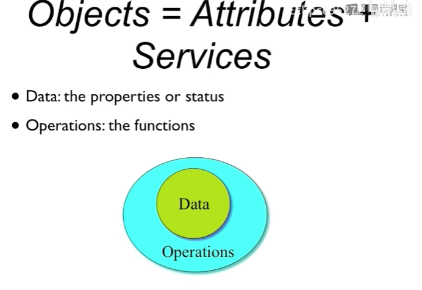
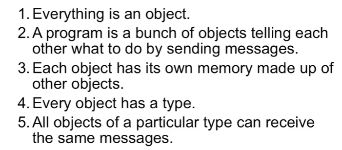

### hello world

蛋图：

面向对象：

1. 基本原则：数据保护

经典面向对象的总结

1. 告诉做什么而不是怎么做
2. 对象里还是对象
3. 每个对象都有一些基本的东西比如类型
4. （正读反读）一个特定类型的所有对象可以接收相同的消息（所有可以接收相同消息的对象可以被认为相同的类型）
5. 隐藏细节
6. 

### 成员变量的秘密

1. 头文件中的大部分是声明
2. 示例化的对象中的变量只存在与对象中，但是对象中的函数并不属于对象，c++编译器通过机制让函数能够识别到这个对象中的成员（类似this指针）

### 构析和析构

1. c++为了高效，不对数据的初始化进行清除（java会进行，vs的debug会填充一些东西（正好对应国标码的“烫”）），
2. constructor：构造函数、构造器
   1. 和类名相同
   2. 无返回类型
   3. 无法阻止的被调用（一定被调用）

3. destructor：析构函数
4. 结构体也可以有构造函数
5. 

### 对象初始化

### new和delete

